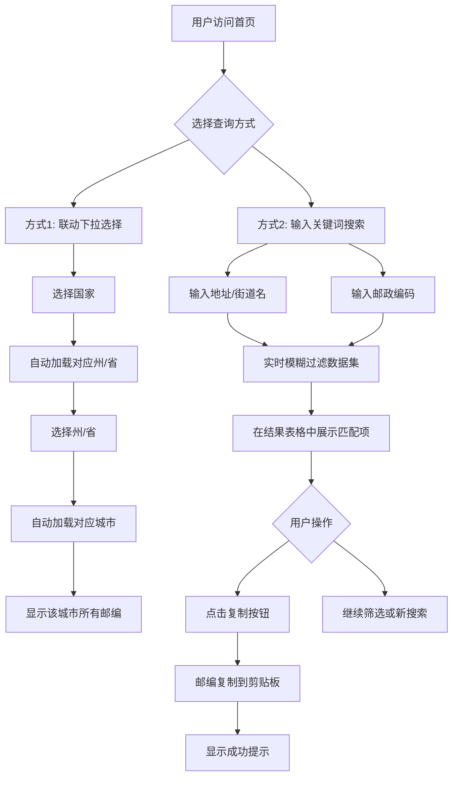
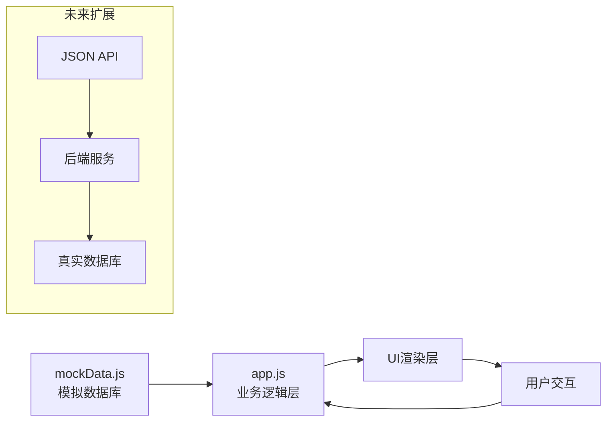

## 1. 产品概述
全球邮政编码查询工具 - 一个面向全球英文用户的免费在线邮政编码搜索平台，支持多国家、多级地区联动查询和双向模糊搜索功能，专为SEO优化和广告变现设计。
- 主要用途：帮助全球用户快速查找任何国家、州/省、城市或地区的邮政编码（ZIP Code）
- 目标市场价值：通过Google AdSense实现流量变现，成为国际物流、电商和跨境贸易从业者的首选工具

## 2. 核心功能

### 2.1 用户角色
| 角色 | 注册方式 | 核心权限 |
|------|----------|----------|
| 匿名用户 | 无需注册 | 查询邮政编码、复制邮编、浏览SEO内容 |

### 2.2 功能模块
1. **首页工具区**：多级联动下拉选择器（国家→州/省→城市）+ 双向模糊搜索输入框
2. **结果展示区**：奇偶行交替的表格展示，带复制按钮
3. **SEO内容模块**：结构化文章区域，提升搜索引擎排名
4. **广告位系统**：4个响应式广告占位符，支持未来AdSense接入

### 2.3 页面详情
| 页面名称 | 模块名称 | 功能描述 |
|---------|---------|---------|
| 首页 | Header导航 | 纯文字Logo "ZipFinder Global"，简洁专业 |
| 首页 | 核心工具卡片 | 三级联动下拉框 + 智能搜索框（支持地址↔邮编双向查询） |
| 首页 | 广告位1 | 工具卡片下方的响应式横幅广告（728x90 / 320x50） |
| 首页 | 结果展示区 | 奇偶行表格显示，每行带复制按钮和悬停效果 |
| 首页 | 广告位2 | 搜索结果列表中间的原生信息流广告 |
| 首页 | SEO内容模块 | H1/H2标题 + 3段原创英文文章 + 广告位3嵌入段落间 |
| 首页 | 广告位4 | 侧边栏广告（仅桌面端显示，移动端隐藏） |
| 首页 | Footer页脚 | 隐私政策、服务条款、免责声明链接 |

## 3. 核心流程

### 用户查询流程


### 数据流架构


## 4. 用户界面设计

### 4.1 设计风格
- **主色调**: 专业蓝色 #1E40AF（深蓝）+ 科技绿 #065F46（辅助色）
- **背景色**: 纯白 #FFFFFF + 浅灰 #F9FAFB（卡片背景）
- **按钮风格**: 圆角6px，渐变蓝色背景，白色文字，悬停时加深并添加阴影
- **字体方案**: 
  - 标题字体: 'Space Grotesk' (Google Fonts) - 现代几何感
  - 正文字体: 'DM Sans' (Google Fonts) - 清晰易读
- **布局风格**: 移动端优先的卡片式布局，最大宽度1200px居中
- **图标风格**: 简洁线性图标（Heroicons/SVG），避免复杂图形

### 4.2 页面设计概览
| 页面名称 | 模块名称 | UI元素说明 |
|---------|---------|-----------|
| 首页 | Header | 固定顶部导航栏，高度64px，Logo左对齐，背景半透明毛玻璃效果 |
| 首页 | 核心工具卡片 | 白色圆角卡片(12px)，阴影0 4px 20px rgba(30,64,175,0.08)，内含3个下拉框+1个搜索框 |
| 首页 | 下拉选择器 | 统一样式：边框#E5E7EB，聚焦边框#1E40AF，圆角8px，高度48px |
| 首页 | 搜索框 | 大尺寸输入框(高度56px)，左侧搜索图标，placeholder提示双向搜索 |
| 首页 | 结果表格 | 斑马纹交替行(#FFFFFF/#F9FAFB)，边框1px solid #E5E7EB，圆角8px |
| 首页 | 复制按钮 | 小型圆形按钮(32x32)，图标+悬停变色效果，点击后显示"已复制"tooltip |
| 首页 | SEO内容模块 | 最大宽度800px，段落间距1.5em，H2使用主色调 |
| 首页 | 广告位占位符 | 虚线边框+灰色背景+"Advertisement"标签，明确标识广告区域 |

### 4.3 响应式设计
- **桌面端(≥1024px)**: 双栏布局（主内容75% + 侧边栏25%），显示所有4个广告位
- **平板端(768px-1023px)**: 单栏布局，隐藏侧边栏广告（广告位4），保持其他广告位
- **移动端(<768px)**: 全宽单列布局，堆叠排列所有元素，广告位1改为320x50横幅
- **触摸优化**: 所有可点击元素最小44x44px触控区域，下拉框和按钮增加点击反馈

### 4.4 动画与交互细节
- **页面加载**: 工具卡片淡入上滑动画（opacity 0→1, translateY 20px→0，时长600ms）
- **下拉切换**: 选项变化时下一级下拉框平滑过渡（height动画300ms）
- **搜索实时过滤**: 输入防抖200ms，结果列表渐显效果
- **复制成功**: 按钮脉冲动画 + 浮动提示"Copied!"（自动消失2秒）
- **悬停效果**: 表格行悬停高亮（background: #EFF6FF），按钮阴影加深
- **滚动优化**: 虚拟滚动（如数据量>100条时启用）

## 5. 数据结构设计

### 5.1 Mock Data Schema
```javascript
{
  countries: [
    {
      id: "US",
      name: "United States",
      states: [
        {
          id: "CA",
          name: "California",
          cities: [
            {
              id: "LA",
              name: "Los Angeles",
              postalCodes: [
                { code: "90210", area: "Beverly Hills", type: "Standard" },
                // ...
              ]
            }
          ]
        }
      ]
    }
  ]
}
```

### 5.2 数据规模要求
- 国家数量: ≥3个（US, UK, AU）
- 每国州/省: ≥2个
- 每省城市: ≥2个
- 每城市邮编: 3-5个具体街道/地区
- 总数据量: ≥60条邮编记录

## 6. SEO优化策略

### 6.1 On-Page SEO
- **Title**: Global Postal Code Lookup \| Find Zip Codes Worldwide Easily (≤60字符)
- **Meta Description**: Quickly find postal codes, zip codes, and routing codes for any country, city, or region worldwide. Fast, free, and mobile-friendly postal directory. (≤160字符)
- **H1**: Universal Postal Code & Zip Code Directory
- **H2**: How to Find a Postal Code?
- **结构化数据**: JSON-LD格式（WebSite + SearchAction schema）
- **语义化HTML**: 使用<header>, <main>, <article>, <section>, <nav>, <footer>
- **图片Alt属性**: Logo和装饰图添加描述性alt文本

### 6.2 内容策略
- 原创英文文章3段（每段150-200词），自然融入关键词：
  - "postal code lookup"
  - "find zip codes"
  - "international postal directory"
- 关键词密度: 1-2%（自然分布，不堆砌）
- 内部链接结构：Footer链接到隐私政策等页面
- 广告位3嵌入在第1段和第2段之间

## 7. 性能指标目标
- **首屏加载时间(LCP)**: < 2.5秒
- **首次输入延迟(FID)**: < 100ms
- **累积布局偏移(CLS)**: < 0.1
- **总页面大小**: < 500KB（不含广告脚本）
- **JavaScript执行时间**: < 100ms（初始化阶段）
