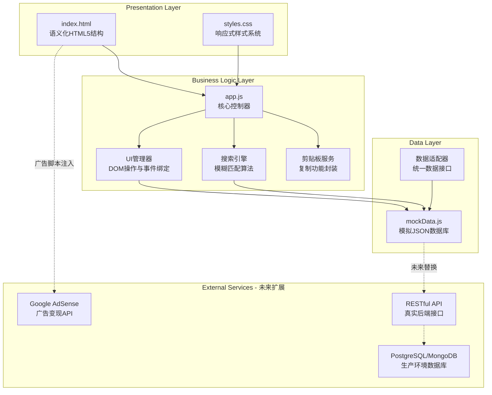
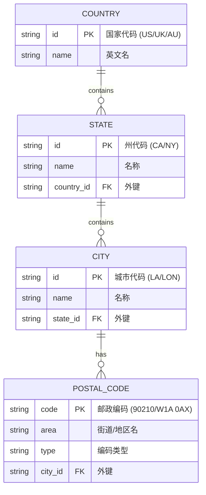

## 1. 架构设计

### 系统架构分层


### 技术选型理由
- **原生HTML/CSS/JS**: 无框架依赖，极致性能，首屏加载<1s
- **模块化ES6**: 清晰的代码组织，便于维护和扩展
- **CSS变量系统**: 主题化管理，支持未来暗黑模式切换
- **Mock Data架构**: 数据与逻辑完全分离，未来可无缝接入API

## 2. 技术栈详细说明

### 2.1 前端技术栈
| 技术 | 版本 | 用途 | 引入方式 |
|------|------|------|---------|
| HTML5 | - | 语义化页面结构 | 本地文件 |
| CSS3 | - | 样式与响应式布局 | 本地文件(styles.css) |
| JavaScript ES6+ | - | 业务逻辑与交互 | 本地文件(app.js) |
| Google Fonts | 最新版 | Space Grotesk + DM Sans字体 | CDN引入 |
| Heroicons | SVG内联 | UI图标系统 | 本地SVG文件 |

### 2.2 开发工具链
- **无需构建工具**: 纯静态网站，可直接部署到任意Web服务器
- **浏览器兼容性**: Chrome/Firefox/Safari/Edge最新2个版本
- **代码规范**: ESLint + Prettier配置（可选）

### 2.3 性能优化策略
- **资源加载**: 
  - 字体使用`font-display: swap`避免FOIT
  - CSS/JS文件gzip压缩后<30KB
  - 无外部依赖（除Google Fonts CDN）
- **渲染优化**:
  - CSS containment隔离重绘区域
  - 虚拟滚动处理大数据集（预留接口）
  - requestAnimationFrame优化动画
- **缓存策略**:
  - 静态资源长期缓存（Cache-Control: max-age=31536000）
  - Service Worker离线支持（未来可选）

## 3. 文件目录结构

```
shijieyoubian/
├── index.html                 # 主页面（入口文件）
├── styles.css                 # 主样式表（响应式+主题变量）
├── app.js                     # 应用核心逻辑（控制器）
├── mockData.js                # 模拟数据源（JSON结构）
├── assets/
│   ├── icons/
│   │   ├── search.svg         # 搜索图标
│   │   ├── copy.svg           # 复制图标
│   │   ├── check.svg          # 成功图标
│   │   └── chevron-down.svg   # 下拉箭头
│   └── images/
│       └── favicon.ico        # 网站图标
├── .trae/
│   └── documents/
│       ├── PRD.md             # 产品需求文档
│       └── tech-arch.md       # 技术架构文档（本文件）
└── README.md                  # 项目说明（可选）
```

## 4. 路由定义

本项目为单页应用(SPA)，无传统路由，采用锚点导航：

| 锚点路径 | 对应区块 | 说明 |
|---------|---------|------|
| `/#tool` | 核心工具卡片 | 页面默认定位位置 |
| `/#results` | 结果展示区 | 搜索后自动滚动至此 |
| `/#seo-content` | SEO内容模块 | Footer链接跳转目标 |
| `/privacy-policy` | 隐私政策页 | 未来独立页面（当前为占位链接） |
| `/terms-of-service` | 服务条款页 | 未来独立页面（当前为占位链接） |

## 5. API定义（未来扩展预留）

### 5.1 RESTful API 接口规范
```typescript
// GET /api/countries
interface CountriesResponse {
  success: boolean;
  data: Array<{
    id: string;          // 国家代码，如 "US"
    name: string;        // 英文名称，如 "United States"
    stateCount: number;  // 包含的州/省数量
  }>;
}

// GET /api/countries/:countryId/states
interface StatesResponse {
  success: boolean;
  data: Array<{
    id: string;          // 州代码，如 "CA"
    name: string;        // 名称，如 "California"
    cityCount: number;
  }>;
}

// GET /api/search?q=keyword
interface SearchResponse {
  success: boolean;
  data: Array<{
    code: string;        // 邮政编码
    country: string;     // 国家
    state: string;       // 州/省
    city: string;        // 城市
    area: string;        // 街道/地区
    type: string;        // 类型（Standard/PO Box等）
  }>;
  total: number;         // 匹配总数
  took: number;          // 查询耗时(ms)
}
```

### 5.2 数据适配器接口
```javascript
// 当前mockData.js实现的接口（未来替换为API调用）
class DataAdapter {
  async getCountries() { /* ... */ }
  async getStates(countryId) { /* ... */ }
  async getCities(countryId, stateId) { /* ... */ }
  async getPostalCodes(filters) { /* ... */ }
  async search(query) { /* ... */ }
}
```

## 6. 数据模型

### 6.1 实体关系图


### 6.2 数据定义语言（DDL参考 - 未来SQL迁移用）
```sql
CREATE TABLE countries (
    id VARCHAR(2) PRIMARY KEY,
    name VARCHAR(100) NOT NULL UNIQUE,
    created_at TIMESTAMP DEFAULT CURRENT_TIMESTAMP
);

CREATE TABLE states (
    id VARCHAR(10) PRIMARY KEY,
    name VARCHAR(100) NOT NULL,
    country_id VARCHAR(2) NOT NULL,
    FOREIGN KEY (country_id) REFERENCES countries(id),
    INDEX idx_country (country_id)
);

CREATE TABLE cities (
    id VARCHAR(10) PRIMARY KEY,
    name VARCHAR(100) NOT NULL,
    state_id VARCHAR(10) NOT NULL,
    FOREIGN KEY (state_id) REFERENCES states(id),
    INDEX idx_state (state_id)
);

CREATE TABLE postal_codes (
    id INT AUTO_INCREMENT PRIMARY KEY,
    code VARCHAR(20) NOT NULL,
    area VARCHAR(200) NOT NULL,
    type VARCHAR(50) DEFAULT 'Standard',
    city_id VARCHAR(10) NOT NULL,
    FOREIGN KEY (city_id) REFERENCES cities(id),
    INDEX idx_code (code),
    INDEX idx_city (city_id),
    FULLTEXT INDEX ft_area (area)
);
```

## 7. JavaScript模块职责划分

### 7.1 app.js - 主控制器
```javascript
// 核心类: ZipFinderApp
class ZipFinderApp {
  constructor()                    // 初始化DOM引用和数据绑定
  init()                           // 启动应用，绑定事件监听器
  
  // 联动选择器方法
  onCountryChange(e)               // 国家变更→更新州列表
  onStateChange(e)                 // 州变更→更新城市列表
  onCityChange(e)                  // 城市变更→显示邮编列表
  
  // 搜索功能
  onSearchInput(e)                 // 输入防抖→触发模糊搜索
  performSearch(query)             // 执行搜索算法
  renderResults(data)              // 渲染结果表格
  
  // 复制功能
  copyToClipboard(code)            // 调用Clipboard API
  showCopyFeedback(button)         // 显示复制成功动画
  
  // UI状态管理
  setLoading(state)                // 加载状态切换
  clearResults()                   // 清空结果区
  showError(message)               // 错误提示
}
```

### 7.2 mockData.js - 数据源
```javascript
// 导出格式
export const postalData = {
  countries: [...],                // 国家数组（≥3个）
  // 数据统计方法
  getTotalCount() { /* ... */ },
  // 搜索辅助方法
  searchAll(query) { /* ... */ }
};
```

## 8. CSS架构设计

### 8.1 自定义属性系统（CSS Variables）
```css
:root {
  /* 主色调 */
  --color-primary: #1E40AF;
  --color-primary-light: #3B82F6;
  --color-primary-dark: #1E3A8A;
  
  /* 辅助色 */
  --color-secondary: #065F46;
  --color-success: #059669;
  --color-error: #DC2626;
  
  /* 中性色 */
  --color-bg: #FFFFFF;
  --color-bg-alt: #F9FAFB;
  --color-text: #111827;
  --color-text-muted: #6B7280;
  --color-border: #E5E7EB;
  
  /* 间距系统 */
  --space-xs: 0.25rem;
  --space-sm: 0.5rem;
  --space-md: 1rem;
  --space-lg: 1.5rem;
  --space-xl: 2rem;
  --space-2xl: 3rem;
  
  /* 字体 */
  --font-heading: 'Space Grotesk', sans-serif;
  --font-body: 'DM Sans', sans-serif;
  
  /* 圆角 */
  --radius-sm: 6px;
  --radius-md: 8px;
  --radius-lg: 12px;
  
  /* 阴影 */
  --shadow-sm: 0 1px 2px rgba(0,0,0,0.05);
  --shadow-md: 0 4px 20px rgba(30,64,175,0.08);
  --shadow-lg: 0 10px 40px rgba(0,0,0,0.1);
  
  /* 动画 */
  --transition-fast: 150ms ease;
  --transition-normal: 300ms ease;
  --transition-slow: 500ms ease;
}
```

### 8.2 响应式断点
```css
/* 移动端优先 */
/* 默认: < 768px (手机) */

@media (min-width: 768px) {
  /* 平板端 */
}

@media (min-width: 1024px) {
  /* 桌面端: 启用双栏布局 */
}

@media (min-width: 1280px) {
  /* 大屏: 最大宽度容器 */
}
```

## 9. 安全性与最佳实践

### 9.1 XSS防护
- 所有用户输入在插入DOM前进行HTML转义
- 使用textContent而非innerHTML渲染动态内容
- CSP（Content Security Policy）头配置（部署时设置）

### 9.2 性能监控
- 预留Performance Observer API接口
- Web Vitals核心指标采集（LCP/FID/CLS）
- 错误边界捕获和上报机制

### 9.3 可访问性(A11y)
- WCAG 2.1 AA标准合规
- 所有交互元素支持键盘导航（Tab/Enter/Escape）
- ARIA标签完善（role, aria-label, aria-live）
- 颜色对比度≥4.5:1（正文文本）

## 10. 部署方案

### 10.1 推荐托管平台
| 平台 | 特点 | 适用场景 |
|------|------|---------|
| GitHub Pages | 免费静态托管 | 开发测试阶段 |
| Netlify/Vercel | 自动CI/CD + CDN | 生产环境推荐 |
| Cloudflare Pages | 全球CDN + 防护 | 高流量场景 |

### 10.2 构建与发布流程
```bash
# 当前阶段：零构建，直接上传文件
# 未来可选：打包压缩流程
# 1. HTML/CSS/JS minification
# 2. Image optimization (SVG压缩)
# 3. Gzip/Brotli预压缩
# 4. Cache busting (版本哈希)
```

## 11. 未来迭代路线图

### Phase 1 (当前MVP)
- ✅ 基础查询功能
- ✅ Mock数据（3国×2省×2城×4邮编=48+条）
- ✅ 响应式UI
- ✅ SEO基础优化

### Phase 2 (1-2周后)
- 🔄 接入真实API或大型JSON数据集（覆盖100+国家）
- 🔄 Google AdSense广告位激活
- 🔄 隐私政策/服务条款完整页面
- 🔄 多语言支持（中文/西班牙语等）

### Phase 3 (1个月后)
- ⬜ 用户收藏常用邮编（LocalStorage）
- ⬜ 批量查询功能
- ⬜ 地图可视化集成（Leaflet/OpenStreetMap）
- ⬜ PWA支持（离线可用 + 安装到主屏幕）
